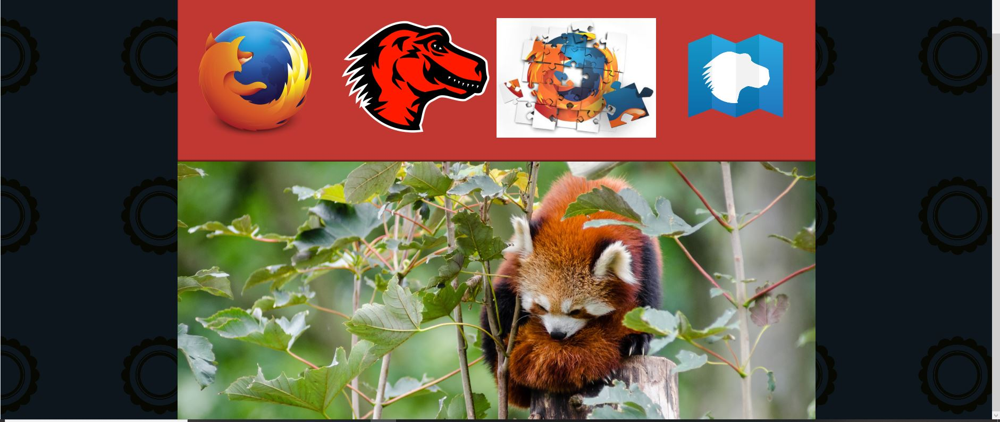

# Examen HTML 3
## Descripion
Este es el la parte 3 del examen. Hemos de cojer un codigo html con las imganes y dejarlo igual a un resultado que nos pide

## Link del index 
<a href="https://github.com/mdn/learning-area/tree/master/html/multimedia-and-embedding/mdn-splash-page-start">Index<a/>

## Link del patern 
<a href="https://github.com/mdn/learning-area/blob/master/html/multimedia-and-embedding/mdn-splash-page-start/pattern.png">Partner<a/>

## Imagenes que necesitaremos 
<a href="https://github.com/mdn/learning-area/tree/master/html/multimedia-and-embedding/mdn-splash-page-start/originals">Imagenes<a/>

### Objetivo a cumplir

## Como lo he hecho

1. Descargar los archivos necesarios para hacer la practica
2. Crear carpeta y subir los archivos a esa carpeta
3. Crear un style.css para el style que venia dentro del index
4. Ponemos el el header la imagen de mozilla
5. Posteriormente hay que poner el link del video de youtube del video en el main
6. Lo ultimo que he ido haciendo es poniendo los links para vincular con el href, poner las imagenes con el img y la foto del panda con el picture
